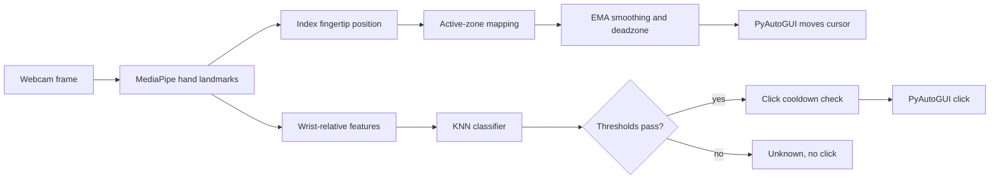

# VisionMouse: Virtual Gesture-Controlled Mouse

A real-time computer vision app that lets you control your mouse with your hand. Your index finger moves the cursor, and two custom hand gestures trigger left and right clicks. Gestures are recognized by a K-Nearest Neighbors (KNN) classifier trained on hand-landmark data that you record yourself.

Built with **Python**, **OpenCV**, **MediaPipe**, and **scikit-learn**.

## How it works



MediaPipe detects one hand per frame and returns 21 landmarks. The index fingertip drives the cursor. All 21 landmarks, taken as (x, y) offsets from the wrist, form the 42 features the KNN classifier uses to tell the click gestures apart.

## Features

- **Fingertip cursor control:** The index fingertip (landmark 8) is mapped to screen coordinates.
- **Ergonomic active zone:** The center 60% of the camera view (a 20% margin on each side) maps to the whole screen, and positions outside it are clamped to the edges. The cursor never gets stuck in a corner, and you don't need to reach across the entire camera frame.
- **Smooth movement:** An Exponential Moving Average (EMA) filter with an adaptive smoothing factor (0.4 for large movements, 0.25 for small ones) and a 2.5-pixel deadzone reduce cursor jitter.
- **Gesture clicks with KNN:** A KNN classifier (k = 8, distance-weighted) recognizes the gestures for left and right clicks. A click only fires if the average distance to the 8 nearest neighbors is at most 0.24, the prediction confidence is at least 75%, and at least 1 second has passed since the last click. These checks reduce false clicks.
- **Live visual feedback:** The camera window shows the hand skeleton and a bounding box with the predicted gesture and confidence. The box is green when a gesture is recognized and red when it is rejected as "Unknown." This helps visualize what the model is processing.

## Results and limitations

**Results**

- Dataset: 400+ hand-landmark samples across two classes (`Left_Click`, `Right_Click`).
- Model: KNN with k = 8 and distance weighting.
- Accuracy: 98% on a held-out 20% test split (80+ samples, random split with `random_state=42`).

**Limitations**

- No neutral class (unknown gestures won't be recognized as such) 
- Accuracy may drop due to differences in cameras or lighting.
- There is no double-click or click-and-drag.
- This uses one hand as the default
- The distance threshold, confidence threshold, cooldown, and active-zone margin are constants in `recognize.py`. Stricter thresholds reduce false clicks but can reject genuine gestures.
- No latency or frame-rate benchmarks are included.

## Project structure

| File | Purpose |
| --- | --- |
| `main.py` | Menu that launches each mode |
| `collect_data.py` | Records labeled landmark samples to `gesture_data.csv` |
| `train_model.py` | Trains the KNN classifier and saves it as `gesture_model.pkl` |
| `recognize.py` | Runs cursor control and gesture clicks |
| `test_gestures.py` | Shows live predictions without controlling the mouse |
| `handtracker.py` | MediaPipe wrapper: landmark detection, feature extraction, and drawing |
| `hand_landmarker.task` | MediaPipe hand landmark model |

`gesture_data.csv` and `gesture_model.pkl` are created in the project folder as you use options 1 and 2.

## Getting started

**Requirements:** Python 3, a webcam, and a desktop OS (PyAutoGUI controls the real system cursor).

1. Clone the repository and open the project folder.

2. Install the dependencies:

   ```bash
   pip install opencv-python mediapipe scikit-learn pyautogui joblib pandas
   ```

3. The MediaPipe `hand_landmarker.task` model file is included in this repository. Keep it in the same folder as `main.py`.

4. Start the control center:

   ```bash
   python main.py
   ```

## Usage

Collect data and train before running the mouse, since the classifier is trained on your own gestures.

| Option | Menu item | What it does |
| --- | --- | --- |
| 1 | Collect gesture data | Press `1` to save a Left_Click sample or `2` to save a Right_Click sample. Each keypress saves one frame while your hand is visible. Press `q` to finish. |
| 2 | Train or retrain model | Trains the KNN classifier, prints its accuracy on the held-out test split, and saves the model. |
| 3 | Run gesture recognition | Starts mouse control. Press `c` to re-center the cursor and `q` to quit. |
| 4 | Test gesture recognition | Shows live predictions without moving the mouse or clicking. It applies the neighbor-distance check but not the 75% confidence threshold. Press `q` to quit. |

You choose the two poses yourself while collecting data. Any two clearly different hand shapes work, and collecting varied samples (different distances and angles) improves reliability.

**Safety note:** PyAutoGUI's corner fail-safe is disabled in `recognize.py`. To stop the program, press `q` with the camera window focused, or press `Ctrl+C` in the terminal.
